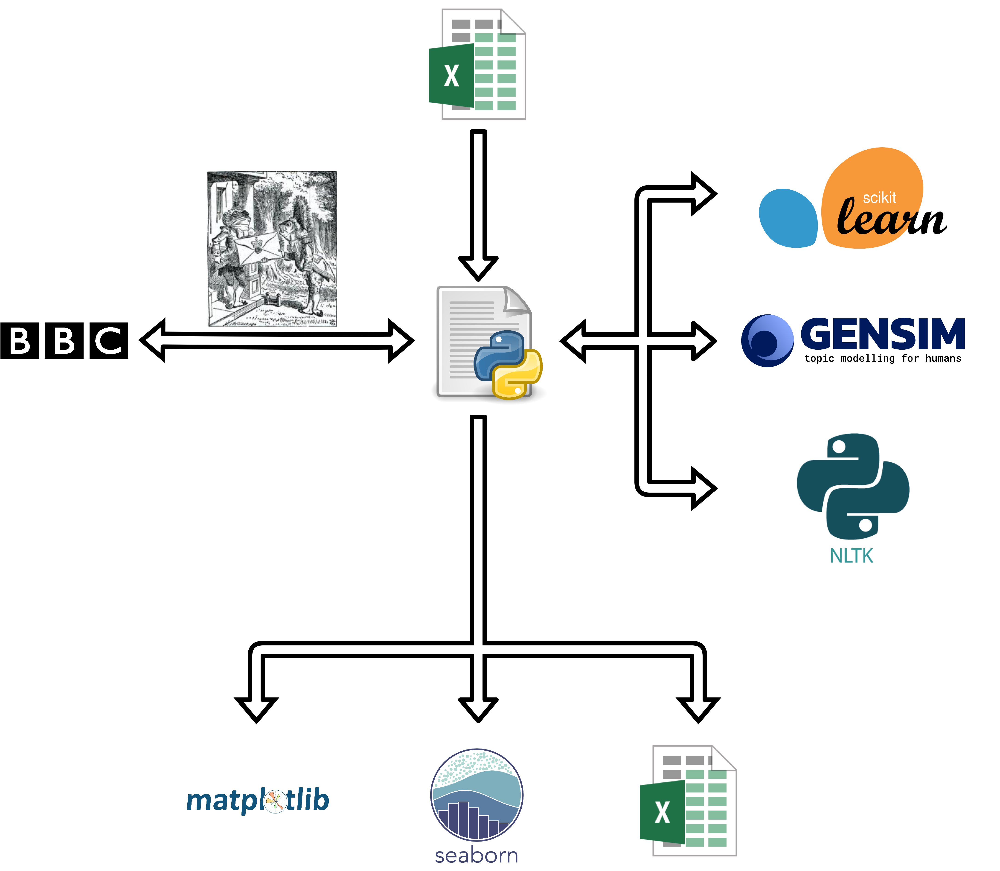

# Semilarity
## Overview
A natural language processing program that collects BBC news articles and uses a neural network to calculate the semantic similarities and distances to place concepts in an abstract metric space from the perspectives of the writers' semantics and search engine's scope.

## Usage
As of the last commit, the python script containing the entire program is stored in `main.py`.
`keywords.xlsx` stores the ten keywords that are input into the program. Support for a variable number of keywords will be added soon.

## Architecture


## How it Works
Search terms will be refered to as keywords and are read in from the first row of `keywords.xlsx`.  

A GET request is made for a BBC search using each keyword. The search results page is then parsed for links that are known to lead to BBC News articles only. Each valid result URL is opened with yet another HTTP request and the text from the article is downloaded as a `.txt` file in a directory created for the keyword.  

The article text is alsow saved to a corpus list data structure. This will be used for all natural language processing from here on.  


First a TF-IDF statistical analysis is executed on the corpus to generate a matrix of TF-IDF scores for the keywords. Next, stop words are removed from the corpus to prepare it for a more thorough analysis using a neural network. This will involve tokenizing the articles to build a vocabulary and then training the neural network. The trained neural network can then embed our articles into an abstract semantic vector space from which semantic distances and cosine simalarities between vectors are computed.  

The main results (Semantic Distances, Cosine Similarities and TF-IDF scores) are then visualised to characterise the behaviour of the artciles in question.

For a detailed explanation of the workings, the report for this project will be uploaded in the near future.

## Results
For the deault set of search terms (which are cyber security related, and found in `keywords.xlsx` in this repo), the following semantic distances were obtained,  
  

with the semantic distances and cosine similarity scores being distributed as follows.  
  

To get an idea of where each search term lies with respect to eachother, the violin plot shows a kernel density estimate of the spread of typical distances for each search term.  

  

Additionally, the Term Frequency Inverse Document Frequency (TF-IDF) statistic was also used to compare the interpretations of the two algorithms to the same corpus.

  


## Dependencies
The full scope of interaction of dependencies was described in the Architecture section. The dependencies used in this project are:

```
beautifulsoup4
gensim
matplotlib
networkx
nltk
numpy
openpyxl
pandas
requests
scikit-learn
scipy
seaborn
sklearn
soupsieve
```
as listed in `requirements.txt`.

## Installation
After cloning the repo, add your search terms to `keywords.xlsx' and run the program from your commandline. All visualisiations will be plotted automatically.
```
python main.py
```
Note: Some command lines may need `python3` to be entered instead of `python` for the above command.